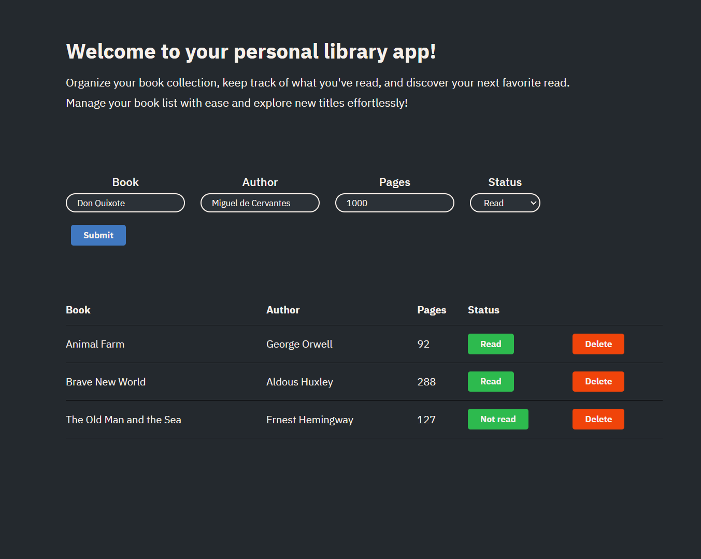

# Library App 📚  

**Screenshot**  
[](https://555viktor.github.io/odin-library/)

**Live Preview**  
Check out the deployed project here: https://555viktor.github.io/odin-library/ or click the image.  

## **Project Overview**  
Built for book enthusiasts, this app offers a simple way to organize your reading journey. Add titles in any language, update their read status, and keep track of your library in an elegantly designed, user-friendly environment.  

## **Features**  
This project offers a variety of features to enhance the user experience:  

- **User-Friendly Interface**: Darker color palette for an eye-friendly experience. 
- **Responsive Design**: Works flawlessly across desktops, tablets, and mobile devices.  
- **Add Books**: Enter the book’s title (in any language), author, number of pages, and its read status.  
- **Dynamic Controls**: Buttons for adding books and toggling read status provide seamless interaction.  
- **Read Status Toggle**: Update the read status of any book with a single click.
- **Delete Books**: Easily remove books from the list.    
- **Input Validation**: Ensures all fields are filled before adding a book.


## **Technologies Used**  
- **HTML**: Page structure and layout.
- **CSS**: Page styling and design.  
- **JavaScript**: Handles user interactions, manages the book list, and enables dynamic functionality.


## **Installation**  
To get started with this project locally:  

1. Clone the repository to your machine:  
   ```bash
   git clone https://github.com/555Viktor/odin-library.git
   ```  
2. Navigate into the project folder:  
   ```bash
   cd odin-library
   ```  
3. Open `index.html` in your preferred browser to start managing your library!  


## **Usage**  
1. **Add a Book**:  
   - Fill out the book details: Title, Author, Pages, and Read Status.  
   - Click the "Submit" button to add it to your library list.  

2. **Delete a Book**:  
   - Click the "Delete" button next to any book to remove it from the list.  

3. **Toggle Read Status**:  
   - Update the book's read status with a single click on the "Read/Not Read" button.  

4. **Responsive Design**:  
   - Use the app on any device for a seamless experience.  


## 🛠️ **Future Enhancements**  
- **Persistent Storage**: Add local or cloud storage to save the book list across sessions.  
- **Enhanced Styling**: Improve the UI further for better accessibility and aesthetics.  


## **Acknowledgements**  
This project was created as part of The Odin Project's curriculum and personal experimentation. Big thanks to The Odin Project for the foundational knowledge and guidance!
